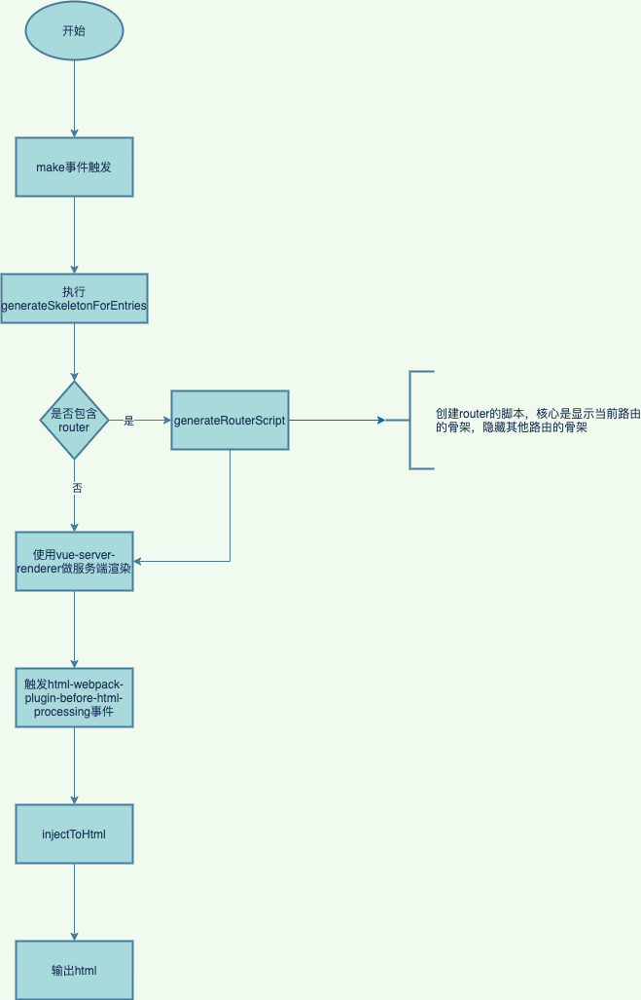

# 骨架屏
## 什么骨架屏
骨架屏就是在数据加载完成前，先给用户展示出大致的结构，拿到数据后再渲染出实际的页面去替换它。这样做的好处是能降低用户等待的焦灼感，又能使页面的加载过程变得自然通畅，不会造成网页长时间的白屏或闪烁。

## 常见的三种实现方式
### 用图片作为骨架屏
跟loading图基本一致，区别在于loading的图形更简单，而骨架屏则需要根据具体页面抽离一个轮廓图形出来。

#### 优点
简单，粗暴，但是省心省力，只需要让设计出图就可以

#### 缺点
通用性和灵活性不足，如果更改页面结构需要出新的图，还有就是换个项目，就得重新设计

### vue-skeleton-webpack-plugin
这是一个webpack插件，需要和webpack结合使用，具体实施可以参考[官方文档](https://github.com/lavas-project/vue-skeleton-webpack-plugin)。我这里也实现了一个多页多路由的demo，详情见[这里](https://github.com/EternallyMaybe/prerender/tree/master/vue-skeleton1)。

插件内部实现并不复杂，主要是监听html-webpack-plugin的异步事件html-webpack-plugin-before-html-processing，然后通过vue-server-renderer渲染出html文件插入到对应的html文件中。附上流程图：



#### 优点
1. 配置比较灵活，可以通过一个独立的vue文件来进行控制
2. 使用范围较广，支持路由、多页应用

#### 缺点
1. 配置较多，比较麻烦
2. 不够自动化，维护起来比较麻烦，只是一些简单样式的调整，就需要更改骨架屏的代码

### page-skeleton-webpack-plugin
这也是webpack插件，由饿了么前端维护，它可以根据项目中的不同路由生成对应的骨架屏页面，然后将骨架屏页面通过webpack打包到对应的路由页面中。

核心功能就是通过 puppeteer 在服务端操控 headless Chrome 打开开发中的需要生成骨架屏的页面，在等待页面加载渲染完成之后，在保留页面布局样式的前提下，通过对页面中元素进行删减或增添，对已有元素通过层叠样式进行覆盖，这样达到在不改变页面布局下，隐藏图片和文字，通过样式覆盖，使得其展示为灰色块。然后将修改后的 HTML 和 CSS 样式提取出来，这样就是骨架屏了。流程图如下：


#### 优点
1. 配置简单，只需要配置webpack
2. 自动化，即使页面布局调整，也无需添加额外代码
3. 功能强大，可以通过可视化页面进行操作，可选择生成时机或编辑骨架屏

#### 缺点
1. 只支持单页应用
2. 没人维护，随着webpack的升级，可能踩各种坑

#### 采坑点
1. vue-cli3如果配置了此插件，本地运行时会报端口占用错误，具体解决方案[见此](https://segmentfault.com/a/1190000020416483)
2. 模板文件需要加<!-- shell -->，同时html-webpack-plugin插件需要将removeComments设置为false，不然没办法注入骨架屏的代码。

# 预渲染
## 什么是预渲染
在构建时针对某个路由生成对应的静态html文件。与骨架屏的关系，个人理解是预渲染是骨架屏更加具象化的实现，骨架屏只是html元素的轮廓，而预渲染则更加具体，包含了真实的节点或数据，因此使用时需要慎重考虑，在一些预渲染数据和真实数据出入较大的场景，可能采用骨架屏更加合适。


## 具体实现（prerender-spa-plugin + html-critical-webpack-plugin）
目前使用最多是prerender-spa-plugin,这是webpack的一个插件，与vue-cli3相结合，轻松实现预渲染。不过需要考虑环境因素，预渲染一般用在生产环境，对于开发环境不建议使用预渲染，会影响开发效率。prerender-spa-plugin可以预渲染出一个静态页面，这只是影响白屏的一部分因素，在真正访问页面时，css文件和js文件同样会造成影响，js文件比较好解决，可以放在body底部或者设置脚本为defer,css文件怎么解决那？这里会用到一个新的包html-critical-webpack-plugin,这个包作用是提取关键css，内嵌到head标签下，其余css样式表通过预加载的方式进行，这样页面就不用等css文件加载完成再渲染了。下面说下具体配置步骤以及原理。

### prerender-spa-plugin插件


先使用vue-cli3创建一个新项目，并在根目录下创建vue.config.js文件，这里只增加prerender-spa-plugin插件，具体配置如下：
```
// vue.config.js
const path = require('path');
const PrerenderSPAPlugin = require('prerender-spa-plugin');
const Renderer = PrerenderSPAPlugin.PuppeteerRenderer;

module.exports = {
    configureWebpack: config => {
        if (process.env.NODE_ENV !== 'production') return;

        return {
            plugins: [
                new PrerenderSPAPlugin({
                    staticDir: path.join(__dirname,'dist'),
                    routes: ['/'],
                    renderer: new Renderer({
                        inject: {
                            foo: 'bar'
                        },
                        headless: false,
                        renderAfterDocumentEvent: 'render-event'
                    })
                }),
            ]
        }
    }
}
```
prerender-spa-plugin做的事情并不多，核心工作都是@prerenderer/prerender在处理，prerender-spa-plugin主要是监听webpack派发出的afterEmit事件，对@prerenderer/prerenderer进行初始化，然后调用@prerenderer/prerenderer的renderRoutes方法生成HTML片段，最后输出到对应的目录下，这里截取了部分核心代码。
```
const Prerenderer = require('@prerenderer/prerenderer');

PrerenderSPAPlugin.prototype.apply = function (compiler) {
  const afterEmit = (compilation, done) => {
    const PrerendererInstance = new Prerenderer(this._options)

    PrerendererInstance.initialize()
      .then(() => {
        return PrerendererInstance.renderRoutes(this._options.routes || [])
      })
  }

  if (compiler.hooks) {
    const plugin = { name: 'PrerenderSPAPlugin' }
    compiler.hooks.afterEmit.tapAsync(plugin, afterEmit)
  } else {
    compiler.plugin('after-emit', afterEmit)
  }
}
```

@prerenderer/prerenderer在内部创建了服务器，并创建renderer-puppeteer或renderer-jsdom实例访问服务器，生成相应的html片段。
```
// index.js的核心片段
class Prerenderer {
  constructor (options) {
    this._options = options || {}

    this._server = new Server(this)
    // renderer是renderer-puppeteer或renderer-jsdom实例，在Prerenderer的renderers目录下，现在被当成两个独立的包进行发布
    this._renderer = options.renderer
  }

  async initialize () {
    this._options.server.port = this._options.server.port || await PortFinder.getPortPromise() || 13010
    await this._server.initialize()
    await this._renderer.initialize()

    return Promise.resolve()
  }

  renderRoutes (routes) {
    return this._renderer.renderRoutes(routes, this)
    .then(renderedRoutes => {
      renderedRoutes.forEach(rendered => {
        rendered.route = decodeURIComponent(rendered.route)
      })

      return renderedRoutes
    })
  }
}

// server.js核心片段
const express = require('express')
const proxy = require('http-proxy-middleware')
const path = require('path')

class Server {
  constructor (Prerenderer) {
    this._prerenderer = Prerenderer
    this._options = Prerenderer.getOptions()
    this._expressServer = express()
    this._nativeServer = null
  }

  initialize () {
    const server = this._expressServer

    server.get('*', express.static(this._options.staticDir, {
      dotfiles: 'allow'
    }))

    if (this._options.server && this._options.server.proxy) {
      for (let proxyPath of Object.keys(this._options.server.proxy)) {
        server.use(proxyPath, proxy(this._options.server.proxy[proxyPath]))
      }
    }

    server.get('*', (req, res) => {
      res.sendFile(this._options.indexPath ? this._options.indexPath : path.join(this._options.staticDir, 'index.html'))
    })

    return new Promise((resolve, reject) => {
      this._nativeServer = server.listen(this._options.server.port, () => {
        resolve()
      })
    })
  }
}
```
[renderer-puppeteer](https://github.com/JoshTheDerf/prerenderer/blob/master/renderers/renderer-puppeteer/es6/renderer.js)和[renderer-jsdom](https://github.com/JoshTheDerf/prerenderer/blob/master/renderers/renderer-jsdom/es6/renderer.js)都可以拉取远程资源，且可以根据renderAfterDocumentEvent、renderAfterElementExists、renderAfterTime三种方式在合适的时机生成html片段。不过他们之间还是有巨大差异，首先是他们使用的核心包不一样，renderer-puppeteer是对puppeteer的封装，renderer-jsdom是对jsdom的封装。第二个差异是这两个包的核心理念是不一样的，jsdom是纯JS实现了文档对象模型，在node环境模拟DOM操作，puppeteer则是提供了高度封装、使用方便的API来模拟用户在页面的操作、对浏览器事件做出响应，它不局限于DOM操作，可以生成PDF、截图，自动执行不同的用户交互，如键盘输入、表单提交、导航等。


## html-critical-webpack-plugin


# 服务端渲染


# 总结
以上三种就是常用的白屏优化方案，这三种方案开发成本从低到高依次递增，但是优化得效果也同样是递增的。除此之外还有一种更简单的方式，那就是使用loading图，因为这种方式用的比较频繁，所以不再赘述。真正实施项目白屏优化时，可以综合上面的优缺点，选择最合适的方案进行实施。

# 地址导航
[vue-skeleton-webpack-plugin的github地址](https://github.com/lavas-project/vue-skeleton-webpack-plugin)

[一种自动化生成骨架屏的方案](https://github.com/Jocs/jocs.github.io/issues/22)