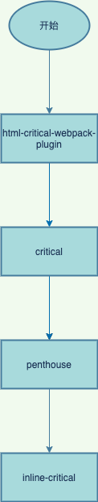

# 骨架屏
## 什么骨架屏
骨架屏就是在数据加载完成前，先给用户展示出大致的结构，拿到数据后再渲染出实际的页面去替换它。这样做的好处是能降低用户等待的焦灼感，又能使页面的加载过程变得自然通畅，不会造成网页长时间的白屏或闪烁。

## 常见的三种实现方式
### 用图片作为骨架屏
跟loading图基本一致，区别在于loading的图形更简单，而骨架屏则需要根据具体页面抽离一个轮廓图形出来。

#### 优点
简单，粗暴，但是省心省力，只需要让设计出图就可以

#### 缺点
通用性和灵活性不足，如果更改页面结构需要出新的图，还有就是换个项目，就得重新设计

### vue-skeleton-webpack-plugin
这是一个webpack插件，需要和webpack结合使用，具体实施可以参考[官方文档](https://github.com/lavas-project/vue-skeleton-webpack-plugin)。我这里也实现了一个多页多路由的demo，详情见[这里](https://github.com/EternallyMaybe/prerender/tree/master/vue-skeleton1)。

插件内部实现并不复杂，主要是监听html-webpack-plugin的异步事件html-webpack-plugin-before-html-processing，然后通过vue-server-renderer渲染出html文件插入到对应的html文件中。附上流程图：

#### 优点
1. 配置比较灵活，可以通过一个独立的vue文件来进行控制
2. 使用范围较广，支持路由、多页应用

#### 缺点
1. 配置较多，比较麻烦
2. 不够自动化，维护起来比较麻烦，只是一些简单样式的调整，就需要更改骨架屏的代码

### page-skeleton-webpack-plugin
这也是webpack插件，由饿了么前端维护，它可以根据项目中的不同路由生成对应的骨架屏页面，然后将骨架屏页面通过webpack打包到对应的路由页面中。

核心功能就是通过 puppeteer 在服务端操控 headless Chrome 打开开发中的需要生成骨架屏的页面，在等待页面加载渲染完成之后，在保留页面布局样式的前提下，通过对页面中元素进行删减或增添，对已有元素通过层叠样式进行覆盖，这样达到在不改变页面布局下，隐藏图片和文字，通过样式覆盖，使得其展示为灰色块。然后将修改后的 HTML 和 CSS 样式提取出来，这样就是骨架屏了。流程图如下：

#### 优点
1. 配置简单，只需要配置webpack
2. 自动化，即使页面布局调整，也无需添加额外代码
3. 功能强大，可以通过可视化页面进行操作，可选择生成时机或编辑骨架屏

#### 缺点
1. 只支持单页应用
2. 没人维护，随着webpack的升级，可能踩各种坑

#### 采坑点
1. vue-cli3如果配置了此插件，本地运行时会报端口占用错误，具体解决方案[见此](https://segmentfault.com/a/1190000020416483)
2. 模板文件需要加<!-- shell -->，同时html-webpack-plugin插件需要将removeComments设置为false，不然没办法注入骨架屏的代码。

# 预渲染
## 什么是预渲染
在构建时针对某个路由生成对应的静态html文件。与骨架屏的关系，个人理解是预渲染是骨架屏更加具象化的实现，骨架屏只是html元素的轮廓，而预渲染则更加具体，包含了真实的节点或数据，因此使用时需要慎重考虑，在一些预渲染数据和真实数据出入较大的场景，可能采用骨架屏更加合适。

## 具体实现（prerender-spa-plugin + html-critical-webpack-plugin）
目前使用最多是prerender-spa-plugin,这是webpack的一个插件，与vue-cli3相结合，轻松实现预渲染。不过需要考虑环境因素，预渲染一般用在生产环境，对于开发环境不建议使用预渲染，会影响开发效率。prerender-spa-plugin可以预渲染出一个静态页面，这只是影响白屏的一部分因素，在真正访问页面时，css文件和js文件同样会造成影响，js文件比较好解决，可以放在body底部或者设置脚本为defer,css文件怎么解决那？这里会用到一个新的包html-critical-webpack-plugin,这个包作用是提取关键css，内嵌到head标签下，其余css样式表通过预加载的方式进行，这样页面就不用等css文件加载完成再渲染了。

### prerender-spa-plugin插件
此插件的核心是prerender包，插件本身只监听webpack派发出的afterEmit事件，然后输入HTML文件。prerender主要包含两个功能，一个创建服务器，另外一个功能是初始化渲染引擎去访问服务器。渲染引擎的功能就是访问服务器生成HTML片段进行返回，这里提供了两种引擎puppeteer和jsdom，puppeteer常用来作为爬虫使用，jsdom主要是模拟JS中的文档对象模型，虽然两种引擎的核心理念不一致，但是都可以获取远程文档，所以这里提供了这两种供开发者进行选择。附上简易流程图：

## html-critical-webpack-plugin
这个插件是对critical的封装，主要功能就是读取HTML文档，从中提取关键css（首屏相关的css样式）内嵌到文档头部，其余非关键css继续采用link标签引入，不过这里采用的是预加载的方法进行，待加载完成再执行非关键css。

# 服务端渲染
简单来讲就是服务端将代码和数据结合再转换成最后的HTML。这里只讲述下vue的服务端渲染方案，提供两个入口：客户端入口和服务端入口，然后通过webpack打包成bundle，新版是打包成两个JSON文件vue-ssr-server-bundle.json和vue-ssr-client-manifest.json，vue-ssr-server-bundle.json是包含对文件路径的引用，server.json则包含一些包的引用以及打包后的bundle内容，前端的处理就是这些，重点处理在于服务端，服务端会引入这两个JSON文件以及模板文件，然后调用vue-server-renderer包生成html文件返回给前端。

# 总结
以上三种就是常用的白屏优化方案，这三种方案开发成本从低到高依次递增，优化的效果也同样是递增的，当然凡事无绝对，如果服务端渲染的页面涉及到请求，可能效果还不如预渲染或骨架屏，所以这只能描述的通常情况，特殊情况还得特殊处理。除此之外还有一种更简单的方式，那就是使用loading图，因为这种方式用的比较多，操作简单，所以不再赘述。真正实施项目白屏优化时，可以综合上面的优缺点，选择最合适的方案进行实施。

# 地址导航
[vue-skeleton-webpack-plugin的github地址](https://github.com/lavas-project/vue-skeleton-webpack-plugin)

[一种自动化生成骨架屏的方案](https://github.com/Jocs/jocs.github.io/issues/22)